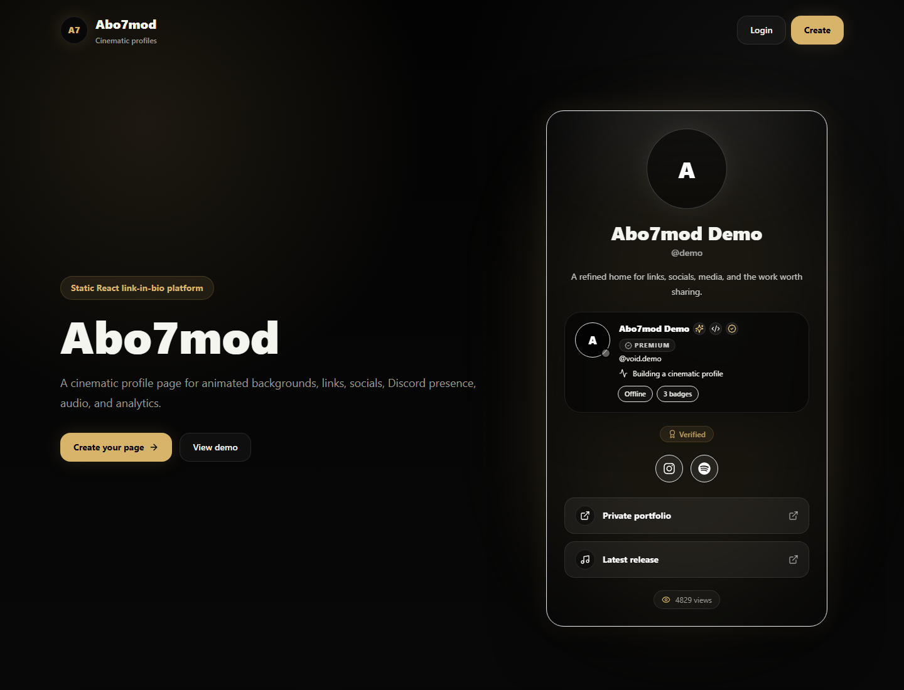
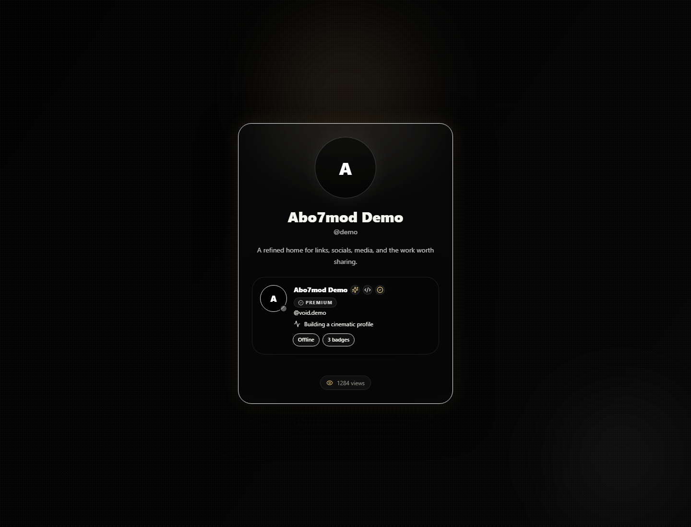
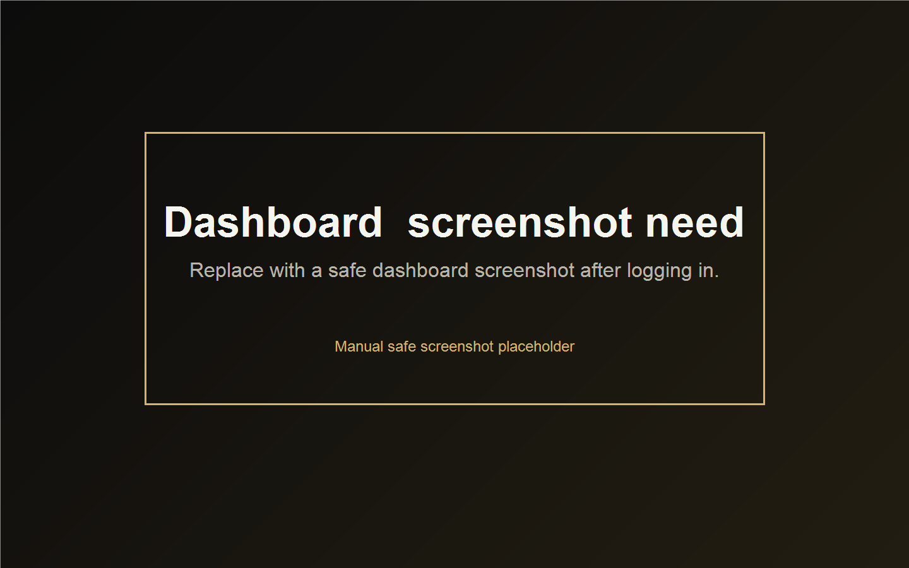
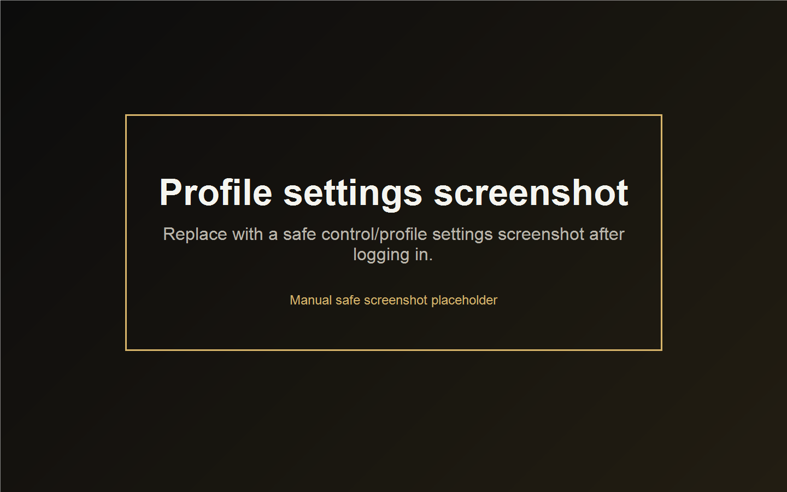

# Abo7mod Profile

منصة بروفايل سينمائية قابلة للتخصيص لعرض الروابط، الحسابات، الموسيقى، الخلفيات المتحركة، بطاقة Discord، ومؤثرات الماوس بشكل أنيق.

## المميزات

- صفحة بروفايل عامة
- خلفيات متحركة صورة / GIF / فيديو
- مشغل موسيقى
- روابط اجتماعية
- روابط مختصرة
- بطاقة Discord يدوية أو عبر Lanyard
- شارات Discord يدوية
- أفتار متحرك صورة / GIF / WebP / فيديو
- مؤثرات تتبع الماوس
- لوحة تحكم للتخصيص
- Supabase Auth + Database + Storage
- نشر يدوي على Netlify

## التقنيات

Vite, React, TypeScript, Tailwind CSS, Supabase, Netlify

## لقطات الشاشة

توجد لقطات شاشة آمنة داخل مجلد `docs/screenshots`.









## التشغيل المحلي

ثبت الحزم:

```bash
npm install
```

شغل بيئة التطوير:

```bash
npm run dev
```

ابن نسخة الإنتاج:

```bash
npm run build
```

## متغيرات البيئة

ملف `.env` مطلوب للتشغيل المحلي فقط، ويجب عدم رفعه إلى GitHub. استخدم `.env.example` كقالب بقيم فارغة:

```bash
VITE_SUPABASE_URL=
VITE_SUPABASE_ANON_KEY=
VITE_SITE_URL=
VITE_ADMIN_EMAILS=
```

## ملاحظة أمنية

لا ترفع ملف `.env` أو أي مفاتيح خاصة إلى GitHub.

## الرخصة

MIT
